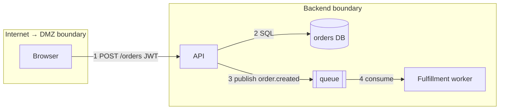

# 01 — Methodology Selection & Continuous Threat Modeling

Pick the cheapest methodology that surfaces the threats that matter for THIS
change. Methodology is a lens, not a deliverable; the deliverable is a set of
dispositioned threats (see `04`, `05`).

## 1. Decision table — which method, when

| Situation | Method | Why |
|---|---|---|
| Default for any service/feature with a DFD | STRIDE-per-interaction | Best coverage-to-effort for technical threats at boundaries |
| Quick element-level sweep, early sketch | STRIDE-per-element | Faster, coarser; fine when interactions aren't designed yet |
| Personal data collected/stored/shared | LINDDUN (added to STRIDE, never instead) | STRIDE misses linkability, identifiability, non-compliance |
| One crown-jewel asset (signing key, payment flow, model weights) | Attack tree | Forces enumeration of ALL paths to one goal, incl. non-technical |
| Business-risk-driven, exec-facing, regulated org | PASTA (or PASTA-lite) | Ties threats to business impact; expensive — don't use for sprints |
| Understanding a realistic adversary's end-to-end campaign | Kill chain / ATT&CK mapping | Validates detection & response coverage, not just prevention |
| Small, low-risk delta; PR review; time-boxed | Shostack's four questions only | 15 minutes of structured thinking beats zero minutes of process |

Rationale: methods fail in predictable ways — STRIDE over-generates duplicates,
LINDDUN is privacy-only, PASTA stalls in stage ceremony, attack trees go stale.
Combine narrowly; never run all of them "to be thorough."

## 2. STRIDE — per-element vs. per-interaction

### The mnemonic, with the property each violates

| Threat | Violated property | Canonical question |
|---|---|---|
| **S**poofing | Authentication | Can the caller lie about who it is? |
| **T**ampering | Integrity | Can data/code be modified in flight or at rest? |
| **R**epudiation | Non-repudiation | Can an actor deny an action because we can't prove it? |
| **I**nformation disclosure | Confidentiality | Can data leak to someone unauthorized? |
| **D**enial of service | Availability | Can the element be exhausted, crashed, or locked? |
| **E**levation of privilege | Authorization | Can a low-priv actor do high-priv things? |

### Per-element (coarse)

Apply the applicable subset to each DFD element type:

| Element | S | T | R | I | D | E |
|---|---|---|---|---|---|---|
| External entity | x | | x | | | |
| Process | x | x | x | x | x | x |
| Data store | | x | x | x | x | |
| Data flow | | x | | x | x | |

Use when: the design is a sketch, you need breadth in 30 minutes. Cost: misses
threats that only exist because of WHO talks to WHOM (e.g., a queue consumer
trusting producer-supplied IDs).

### Per-interaction (default)

For each data flow that **crosses a trust boundary**, ask all six STRIDE
questions about the tuple *(source, flow, destination)*. Skip flows that stay
inside one boundary at one privilege level unless they carry a crown-jewel
asset. Rationale: ~90% of exploitable design flaws live at boundary crossings;
per-interaction concentrates effort there and naturally produces
*actor → action → asset* threat sentences.

### Worked mini-example



STRIDE-per-interaction on flow 1 (crosses TB1→TB2):
- **S**: forged/alg-confused JWT → API acts as another user. Mitigation: verify
  alg allowlist + issuer + audience; requirement `SR-101`.
- **T**: order body altered client-side (price field trusted). Mitigation:
  server-side price lookup; `SR-102`.
- **R**: user disputes placing order. Mitigation: signed audit log incl. JWT sub
  + request hash; `SR-103`.
- **I**: order IDs sequential → enumeration of others' orders via GET.
  Mitigation: authz check object-level + UUIDv7; `SR-104`.
- **D**: unbounded order payload / no rate limit. Mitigation: body size cap +
  per-user rate limit; `SR-105`.
- **E**: `role` claim taken from request body, not token. Mitigation: derive
  authz only from verified token/server state; `SR-106`.

Flow 4 (inside TB2) still gets a pass because the worker acts at higher
privilege than the producer's data deserves: poisoned `order.created` message
with attacker-chosen `shipping_address` and `sku` → **T/E** on the worker.
Lesson: a queue is a deferred entry point; producer authentication and message
schema validation are boundary controls (see `03` §queue).

## 3. LINDDUN — privacy threats (run WITH STRIDE when PII flows)

| Threat | Question to ask per flow/store holding personal data |
|---|---|
| **L**inking | Can two records/actions be tied to the same person across contexts? |
| **I**dentifying | Can a "pseudonymous" subject be re-identified (quasi-identifiers, logs, analytics)? |
| **N**on-repudiation | Can the subject NOT plausibly deny an action they should be able to deny? (inverse of STRIDE-R) |
| **D**etecting | Can an outsider learn a person exists in the system (login timing, "email already registered")? |
| **D**ata disclosure | Is more personal data collected/stored/shared than the purpose needs? |
| **U**nawareness | Does the subject not know what's collected or shared? |
| **N**on-compliance | Does the flow violate stated policy / GDPR-class obligations (retention, purpose, residency)? |

Use LINDDUN GO (card-style, per-flow prompts) for sprint-speed work; full
LINDDUN per-element only for new products handling sensitive categories.
Mini-example: the orders DFD above stores `shipping_address`. LINDDUN adds:
**L** — address joins orders across guest checkouts into a profile; **D**etect —
"email already used" on checkout leaks account existence; **N**on-compliance —
no retention period on fulfilled orders. None of these fall out of STRIDE.

## 4. PASTA — when business context must drive the model

Seven stages: (1) business objectives → (2) technical scope → (3) decomposition
→ (4) threat analysis (intel-driven) → (5) vulnerability analysis → (6) attack
modeling/simulation → (7) risk & impact analysis. Use full PASTA only when the
audience is risk owners/executives and the system is business-critical or
regulated. Otherwise run **PASTA-lite**: write stages 1–2 as a half-page
"business impact preamble" on top of a STRIDE model — it sharpens severity
ratings (`04`) by naming what the business actually loses. Pitfall: PASTA used
as ceremony produces 40-page documents nobody re-reads; cap the artifact.

## 5. Attack trees

Root = attacker goal (a state, not an action): "Read another tenant's
documents." Children = OR/AND-decomposed subgoals down to concrete attack
steps. Annotate leaves with cost/skill/detectability; prune branches whose
cheapest path is dominated by another branch.

```
GOAL: read another tenant's documents
├─ OR exploit the app
│  ├─ IDOR on GET /docs/{id} (no tenant check)        [cheap → mitigate first]
│  └─ SQLi in search → cross-tenant SELECT
├─ OR exploit the platform
│  ├─ AND: SSRF → cloud metadata creds → S3 GetObject on shared bucket
│  └─ misconfigured bucket policy (public-read)
└─ OR exploit people/process
   └─ phish support agent → admin "impersonate" feature
```

Use when: one asset dominates the risk profile, or to communicate "why this
mitigation" to non-modelers. AND-nodes show where a single control kills a
whole branch — invest there. Keep trees ≤3 levels; deeper trees rot.

## 6. Kill chains / ATT&CK

Map a realistic campaign across recon → initial access → execution →
persistence → privilege escalation → lateral movement → exfiltration. Use to
answer "would we DETECT and STOP this, and at which stage?" — i.e., to threat
model detection/response, logging coverage, and segmentation, which
STRIDE-per-interaction does not test. For each kill-chain stage, name the
telemetry that would fire; a stage with no telemetry is a logging requirement
(feeds `05` backlog). Don't use kill chains to find design flaws — that's
STRIDE's job.

## 7. Lightweight: the four questions beat heavyweight process when...

- The delta is small and inside existing boundaries (new field, new report).
- The team will genuinely do a 15-minute pass but would skip a 2-hour workshop.
- You are in a PR review (see §8).

A four-questions pass still produces artifacts: 3–10 threat sentences, each
with a disposition. If the pass surfaces a new trust boundary, new data class,
or new dependency, **escalate** to a full STRIDE model — that's the upgrade
trigger, codify it in the team's definition of ready.

### Worked four-questions pass (feature: "export my data as CSV")

1. *What are we working on?* New `GET /export` endpoint → async job → CSV in
   the uploads bucket → emailed signed link. New flow crosses: user→API,
   job→bucket, email→user.
2. *What can go wrong?*
   - T1: user A triggers export, job exports ALL users' rows (missing tenant
     scope in the bulk query — bulk paths often bypass per-row authz).
   - T2: signed link forwarded/leaked from email → anyone reads the CSV
     (email is an untrusted store; long-expiry link = standing credential).
   - T3: CSV formula injection — `=HYPERLINK(...)` in user-controlled fields
     executes in victims' spreadsheets (your file, their machine).
   - T4: unbounded concurrent exports exhaust DB/worker (D).
3. *What are we going to do?* T1 → reuse tenant-scoped repo + abuse test
   (mitigate); T2 → 15-min expiry + require login to download (mitigate);
   T3 → prefix `'` on `=+-@` cells (mitigate); T4 → 1 concurrent export/user
   (mitigate). No accepts needed.
4. *Did we do a good job?* Four threats, four requirements, three tests;
   re-check at next data-class change. Elapsed: ~15 minutes. T3 is the kind
   of threat a checklist-free brainstorm misses — which is why even the
   lightweight pass consults the relevant catalog (`03` §5 file pipelines).

### Enumeration aids (any methodology)

- **Elevation-of-Privilege / cornucopia card decks:** use for team workshops
  to break "blank page" paralysis; cards are prompts, the output is still
  threat sentences in the table.
- **Organizational threat library:** harvest recurring threats + standard
  mitigations from past models into a reusable library keyed by component
  type; new models import and check applicability rather than re-deriving.
  This is the highest-leverage maturity step after triggers (`05` §4).
- **LLM-assisted enumeration:** useful as a breadth generator against your
  DFD; treat output as candidate threats requiring human reachability
  triage — never paste raw generation into the model (violates the triage-
  capacity rule below).

## 8. Continuous / incremental threat modeling (agile + PRs)

Rules:

1. **Baseline once, then delta forever.** Maintain one living baseline model
   per service (`05` §living). Sprint work models only the diff against it.
2. **Re-model triggers gate stories.** A story matching any trigger — new
   dependency, new entry point (route/queue/cron/webhook/callback), new trust
   boundary, new data class, authn/authz change, crypto change, file or
   deserialization handling — requires a threat-model note before merge.
3. **PR micro-STRIDE (5 minutes, on the diff only):**
   - What NEW input enters, and from whom? (S, T)
   - At whose privilege does the new code run, and what can it now reach? (E)
   - What does it write, emit, or call — including logs and third parties? (I, R)
   - What happens at 1000× volume or with a 100 MB payload? (D)
   Record the answers in the PR description under `## Security notes`; "no new
   input, no privilege change, no new sink" is a valid and useful answer.
4. **Timebox enumeration, not treatment.** Cut off brainstorming at the
   timebox; never cut off writing dispositions for what you found.
5. **One owner per model.** The service's tech lead owns baseline freshness;
   audits (`06`) treat a stale baseline (no update across a trigger-matching
   change) as a finding.

Anti-patterns: threat modeling only at "security review" milestones (too late,
batch too big); tool-generated 200-threat reports pasted into tickets (nobody
triages them — generate ≤ the team's triage capacity); modeling the whole
system every sprint (re-derives known results, exhausts goodwill).

## Audit checklist

- [ ] A documented methodology choice exists and matches the system's risk
      profile (not "we ran a tool").
- [ ] STRIDE applied per-interaction at every trust boundary crossing; flows
      skipped only when source and destination share boundary AND privilege.
- [ ] LINDDUN (or equivalent privacy pass) performed wherever personal data is
      collected, stored, or shared; linkability and detectability considered.
- [ ] Crown-jewel assets have an attack tree or equivalent all-paths analysis.
- [ ] Detection/response coverage assessed (kill-chain or ATT&CK mapping) for
      at least the top abuse scenario; logging gaps captured as requirements.
- [ ] Every threat is an actor→action→asset→impact sentence, not a category.
- [ ] Re-model triggers are defined and observably enforced (PRs matching
      triggers contain security notes; baseline model updated after them).
- [ ] Enumeration volume matches triage capacity — no untriaged threat dumps.
- [ ] Lightweight passes escalate to full models when triggers fire (evidence:
      at least one escalation in history, or no trigger-matching changes).
