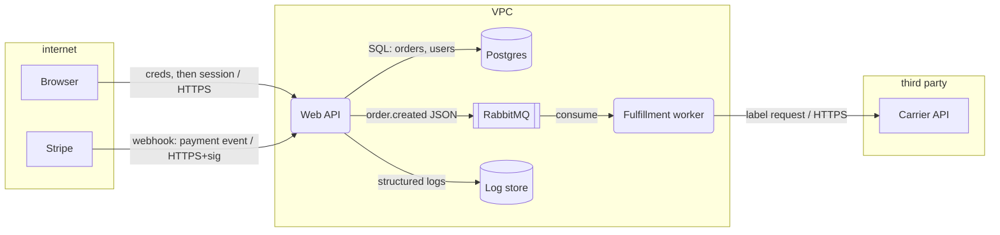

# 02 — System Decomposition: DFDs, Trust Boundaries, and Extraction from Code

Decomposition quality caps threat-model quality: you cannot enumerate threats
against elements you never drew. This file covers (A) building the model and
(B) extracting it from an existing codebase.

## A. Building the model

### 1. DFD element vocabulary

Use exactly four element types plus boundaries — more notation adds cost, not
threats:

| Element | Mermaid convention | Examples |
|---|---|---|
| External entity | `E[Name]` rectangle | user browser, third-party API, attacker, payment provider |
| Process | `P(Name)` rounded | API service, worker, lambda, cron job, LLM agent |
| Data store | `D[(Name)]` cylinder | Postgres, S3 bucket, Redis, browser localStorage, log sink |
| Data flow | labeled arrow | `-->|order JSON / HTTPS|` — label with DATA + PROTOCOL |
| Trust boundary | `subgraph TB_x[...]` | network segment, process/user-priv change, org boundary |

Rules:
- **Label every flow with what data moves and over what channel.** Unlabeled
  arrows hide information-disclosure and tampering threats.
- **Logs, metrics, and backups are data stores.** They hold copies of your
  assets at usually-weaker protection; draw them or you will miss the most
  common disclosure path.
- **The attacker is not drawn; attackers are positions.** Any external entity,
  any compromised element, any element across a boundary is a potential
  attacker position.
- **One diagram per level.** L0 context diagram (system + externals), L1 per
  service. Stop decomposing when every flow within an element is same-trust;
  decompose further when a single box contains a privilege change.

### 2. Trust boundaries — the load-bearing concept

A trust boundary is any line across which the level of trust in data or
identity changes. Draw one wherever ANY of these change:

1. **Network zone** — internet → DMZ → internal → restricted.
2. **Identity/authn** — anonymous → authenticated → admin; service A → service B
   (even "internal" services authenticate to each other or share a boundary).
3. **Process privilege** — user-mode app → root daemon; container → host.
4. **Organization/control** — your code → third-party SaaS, package registry,
   customer-supplied plugin, model provider.
5. **Data validation state** — raw upload → parsed/validated object. (Parsers
   ARE boundary controls; file parsing is a boundary crossing.)
6. **Time** — producer → queue → consumer; data written now, executed later
   (stored XSS, poisoned cache, scheduled job args). Deferred trust is still
   crossing trust.

Heuristic: if compromising X gives the attacker nothing they didn't already
have at Y, then X and Y share a boundary. If you "aren't sure" whether two
elements share a boundary, they don't — model the crossing.

### 3. Entry points, assets, actors, privilege levels

Produce these four tables for every model; they are the enumeration substrate.

**Entry points** — every place external data or control enters:

| ID | Entry point | Channel | Authn required | Reaches |
|---|---|---|---|---|
| EP1 | `POST /api/orders` | HTTPS | JWT (user) | API → DB, queue |
| EP2 | `order.created` consumer | AMQP | broker creds (any internal producer) | worker → shipping API |
| EP3 | Stripe webhook `/hooks/stripe` | HTTPS | signature header | API → DB |
| EP4 | nightly `reconcile` cron | scheduler | none (implicit) | DB read/write |

**Assets** — what an attacker wants; rank them:

| ID | Asset | Class | Worst-case impact |
|---|---|---|---|
| A1 | customer PII (orders, addresses) | personal data | regulatory + churn |
| A2 | Stripe API key | credential | financial fraud |
| A3 | order integrity (prices, states) | business data | direct loss |
| A4 | service availability | availability | SLA breach |

Include **abstract assets**: reputation, compute (cryptomining), your users'
trust in messages you send (phishing-from-you), and your system as a pivot
into others.

**Actors and privilege levels:**

| Actor | Privilege | Notes |
|---|---|---|
| anonymous internet | none | reaches EP1 pre-auth surface, EP3 |
| customer | own-tenant read/write | the IDOR baseline |
| support agent | cross-tenant read, impersonate | high-value phish target |
| CI pipeline | deploy + secrets | machine actor, often over-privileged |
| `api` service account | DB rw, queue publish | blast radius if API popped |

Always include **machine actors** (service accounts, CI, cron) — they hold the
broadest standing privilege in most real systems — and at least one **insider**
actor.

### 4. Worked mini-example — 10-line DFD with threats



Boundary crossings → headline threats (full enumeration via `03` catalogs):
- B→W: credential stuffing (S), session fixation (S), tampered order body (T).
- S→W: forged webhook if signature unchecked or timestamp not validated —
  replay marks orders paid (S/T).
- W→L: PII/credentials in logs — disclosure to anyone with log access (I);
  log store is a data store, modeled as such.
- Q→F: time-shifted boundary — poisoned message executes later at worker
  privilege (T/E); broker creds shared by all internal producers = weak authn.
- F→C: carrier creds in worker env (I); carrier outage stalls queue (D);
  response from C is untrusted input INTO F (T) — third-party responses cross
  a boundary inward too.

## B. Extracting the model from an existing codebase (AUDIT mode)

Reconstruct entry points, flows, stores, and boundaries from artifacts in this
order — code lies less than docs.

### 5. Entry-point extraction by mechanism

Search patterns (adapt to stack; run broad, then verify by reading):

| Mechanism | What to grep / read |
|---|---|
| HTTP routes | framework registrations: `@app.route|@Get\(|router\.(get|post)|http.HandleFunc|urlpatterns|#\[get\(`; OpenAPI specs; ingress/ALB rules in IaC |
| gRPC | `.proto` files, `RegisterService`, server interceptors (authn lives here) |
| Queue/stream consumers | `@KafkaListener|consumer|subscribe|sqs.receive|channel.basic_consume|pubsub.*subscription`; broker IaC for topic ACLs |
| Cron/scheduled | `crontab`, k8s `CronJob`, `@Scheduled|celery beat|cloudwatch event|cloud scheduler`; note: cron handlers often skip authn entirely |
| Webhooks (inbound) | routes named `hook|callback|notify|ipn`; verify presence of signature validation NEXT TO the route |
| Third-party callbacks | OAuth `redirect_uri` handlers, payment IPN, SSO ACS endpoints — high-trust by design, check state/nonce/signature |
| File ingestion | upload routes, `multipart`, S3 event triggers, watched directories, email-attachment pipelines |
| CLI/admin | `argparse|cobra|click` entry points, `/admin` routes, debug endpoints (`/actuator|/debug/pprof|graphql introspection`) |
| Outbound that returns | every HTTP client call site is an entry point for the RESPONSE (deserialization, SSRF-redirects) |

For each hit record: path:line, authn mechanism (or none), input schema,
downstream reach. **An entry point with no findable authn check is a finding,
not a TODO.**

Worked extraction excerpt (Flask + Terraform monorepo):

```
$ grep -rn "@app.route\|@bp.route" services/ | wc -l        → 38 routes
$ grep -rn "@require_auth\|@login_required" services/ | wc -l → 31 decorators
  → 7 routes to read by hand. Verdict: 4 are health/static; 2 are the
    OAuth callback + Stripe webhook (sig-checked, OK); 1 is
    services/admin/jobs.py:14 POST /internal/requeue — NO AUTH. Finding.
$ grep -rn "basic_consume\|@celery" services/               → 5 consumers
$ grep -rn "aws_cloudwatch_event\|CronJob" infra/           → 2 schedules
$ grep -rn "0.0.0.0/0" infra/*.tf
  infra/sg.tf:41 ingress 5432 ← the DB is internet-reachable. Finding.
```

The arithmetic pattern (routes minus auth decorators, then read the
remainder) scales to any framework and is reproducible evidence for the
audit trail (`06` §2).

### 6. Stores, flows, and assets from code

- **Stores:** DB connection strings/ORM configs, S3/GCS client instantiations,
  Redis/memcached, message broker (it stores messages), log/metric sinks,
  `localStorage|document.cookie` in frontend code, mobile keychain/shared-prefs.
- **Data classes/assets:** ORM models and migrations (column names: `email`,
  `ssn`, `dob`, `address`, `token`), secrets managers usage, `.env.example`,
  IaC secret resources. Sequential integer PKs on user-owned resources →
  enumeration risk, note it.
- **Flows:** trace from each entry point to stores/outbound calls. For large
  codebases, trace only flows from entry points that touch top-3 assets —
  depth over breadth.

### 7. Inferring trust boundaries from an existing system

- **Network:** VPC/subnet/security-group/k8s NetworkPolicy in IaC; ingress vs.
  ClusterIP services; "0.0.0.0/0" rules mark the internet boundary precisely.
- **Identity:** where authn middleware is mounted (and which routes are
  EXCLUDED — exclusion lists are boundary holes); service-to-service auth
  (mTLS, IAM, shared static token = weak boundary); IAM policies map machine
  actors to reach.
- **Privilege:** Dockerfile `USER`, k8s `securityContext`, sudoers, DB users
  per service (one shared `app` superuser = no internal boundaries in the data
  tier).
- **Org:** every third-party SDK/API in lockfiles + outbound allowlists; each
  is an org boundary with its own catalog pass (`03`).

Then DIFF inferred boundaries against any documented architecture: each
mismatch (documented boundary absent in code, or real flow absent from docs)
is itself a finding — drift is how systems rot.

### 8. Privilege-reach map (what a compromise buys)

For each process and machine actor, answer: "if THIS is compromised, what can
the attacker now reach?" One table, built from creds in env/IAM/DB grants:

| If compromised | Reaches directly | Notable NOT-reach |
|---|---|---|
| Web API pod | orders DB rw, queue publish, Stripe key | carrier creds, CI |
| Fulfillment worker | queue consume, carrier API, orders DB **rw** | Stripe key |
| CI runner | deploy creds, all repo secrets, prod kubeconfig | — |

This table does three jobs: exposes over-privilege at a glance (why does the
worker have DB **write**? why does CI reach prod directly?), provides the
impact half of every rating in `04`, and identifies where one segmentation
control collapses multiple attack-tree branches. In audit mode it is derived
purely from IAM policies, DB grants, and network policy — no interviews
needed, and it rarely matches what the team believes.

### 9. Decomposition outputs

A decomposition is done when you have: L0+L1 mermaid DFDs with boundaries; the
four tables (entry points, assets, actors/privileges, stores) with code refs
in audit mode; and a stated scope ("modeled X; excluded Y because Z"). Excluded
scope must be written down — silent exclusions are where breaches live.

## Audit checklist

- [ ] DFD exists, uses the 4-element vocabulary, every flow labeled with data
      + channel; logs/backups/caches drawn as stores.
- [ ] Trust boundaries explicit and justified by network/identity/privilege/
      org/validation/time changes — not just "internal vs external".
- [ ] Entry-point table covers HTTP, gRPC, queues, cron, webhooks, callbacks,
      file ingestion, admin/CLI, and third-party responses; each row has authn
      mechanism and downstream reach.
- [ ] Every entry point in code appears in the table (grep sweep performed);
      authn-less entry points flagged.
- [ ] Asset table ranks concrete and abstract assets; data classes derived
      from schemas, not memory.
- [ ] Actor table includes machine actors (CI, service accounts, cron) and an
      insider; privilege per actor stated.
- [ ] Boundaries inferred from IaC/middleware/IAM match documented
      architecture; drift recorded as findings.
- [ ] Time-shifted crossings (queues, caches, stored content, scheduled jobs)
      modeled as boundary crossings.
- [ ] Privilege-reach map built from actual grants (IAM/DB/network), and
      over-privilege deltas vs. need recorded.
- [ ] Scope exclusions written down with reasons.
